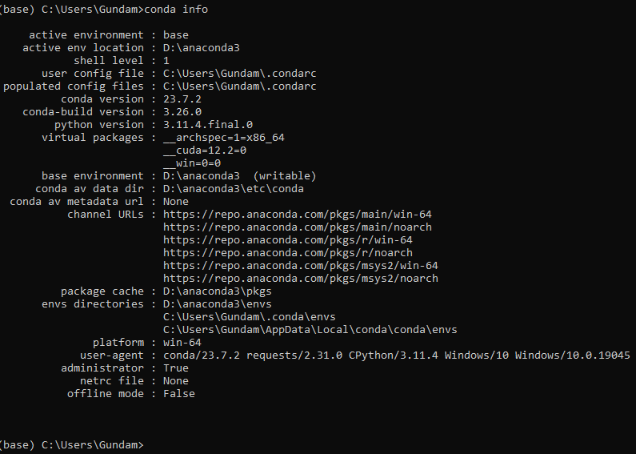

# Task 1:
*In your terminal, run: ``` conda info```*

## Result:



# Task 2:
1. *Run all of the python commands in the table "Linear Algebra Equivalents"* 
  - Note, your latex uses the wrong quote for the opening quote around the table name Linear Algebra. You should have used "\`\`" instead 
2. *Perform this task in IPython/Jupyter and paste the results into my report*
   1. Note: it appears that IPython and Jupyter have been merged or are the same thing. Your instruction clearly states to use IPython which doesn't appear to be a unique name that is being used anymore.


## Result:

# Task 3:
*Run the following script in IPython and paste the figure created by the script into your report*

``` python
import matplotlib.pyplot as plt
plt.plot([1,2,3,4], [1,2,7,14])
plt.axis([0, 6, 0, 20])
plt.show()
```
## Result:

# Task 4:

*Use Matplotlib to create a figure of your choice in IPython. Paste your code and figure into your report*

## Result:

# Task 5:
*Paste your VCS account into your report*

## Result:


# Task 6:
*Start a new project in PyCharm. Commit and push your project to VCS as a public project and share a link of your project in your report*

## Result:
